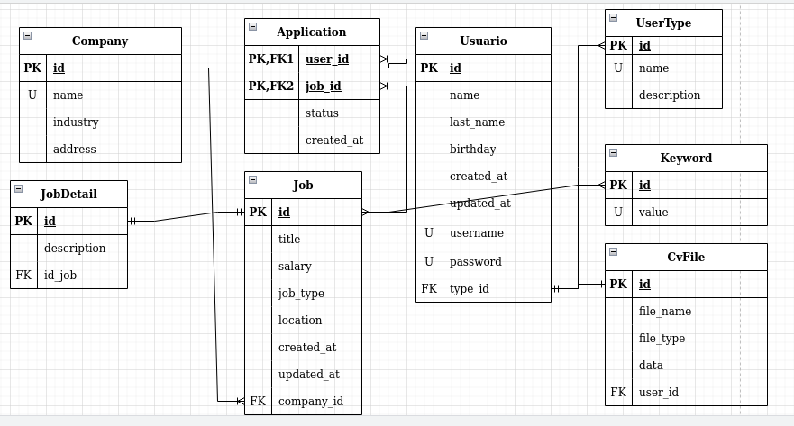

This is a fullstack application project for an online job system where our users can get registered
as a job seeker or as a hiring person, and they will have different accesses and permissions, so it
will use authentication and authorization methods to handle it.

## Technologies
* Java (Spring Boot)
* Spring Security
* Maven Profile
* Maven plugins: Jib, Frontend Maven, Maven Resources
* Angular
* AWS (deployment)
* Docker (containerization, and platform)
* MySQL
* N-Tier Architecture

## Features

* Data Validation
* Customized error messages from the backend (status code)
* DTO mappers
* Responses with pagination (for some requests by using query parameters)
* Authentication and Authorization using Spring Security
* Data validation from the frontend
* Database Storage for PDF files (CV)

### ER diagram

 